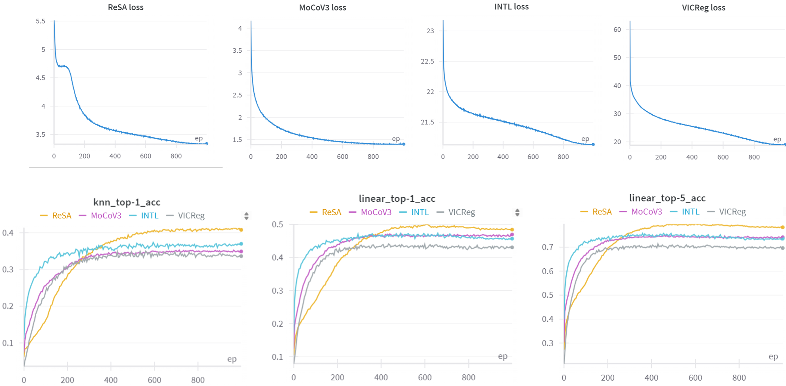

    

Caption: We sincerely appreciate the valuable suggestions provided by all Reviewers, which have been immensely helpful in improving our paper. Here are the results of four self-supervised learning methods (ReSA, MoCoV3, INTL, and VICReg) pre-trained and evaluated on the long-tailed dataset CIFAR100-LT. We followed the setup on https://huggingface.co/datasets/tomas-gajarsky/cifar100-lt, setting an imbalance factor of 1/20, resulting in the CIFAR100-LT dataset containing 15,907 images. We trained these four SSL models for 1000 epochs with ResNet-18 as the encoder and evaluated it on the full CIFAR100 test set. As observed, the loss values of the self-supervised learning methods converge well, but the final evaluation accuracy is significantly lower compared to training on the full CIFAR100 dataset. Interestingly, we notice that ReSA's loss decreases more slowly in the early stages, and its accuracy improves more gradually than other methods. We hypothesize that this may be due to noisy initial clusters in the early stages of training, causing the doubly stochastic matrix to reinforce incorrect associations. However, we find that as training progresses, ReSA's accuracy continues to rise in the mid-phase, surpassing all other methods. This suggests that ReSA is able to gradually resolve these issues and learn the correct clustering patterns as training advances, rather than amplifying errors. Overall, this experiment demonstrates that ReSA can also learn effective representations on long-tailed datasets. 